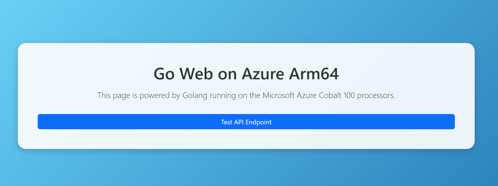

### Baseline testing of Golang Web Page on Azure Arm64
This guide demonstrates how to test your Go installation on Azure Arm64 by creating and running a simple Go web server that serves a styled HTML page.

**1. Create Project Directory**

First, create a new folder called goweb to hold your project and move inside it:

```console
mkdir goweb && cd goweb
```
This makes a directory named goweb and then changes into it.

**2. Create HTML Page with Bootstrap Styling**

Next, create a file named `index.html` using the nano editor:

```console
nano index.html
```

Paste the following HTML code inside. This builds a simple, styled web page with a header, a welcome message, and a button using Bootstrap.

```html
<!DOCTYPE html>
<html lang="en">
<head>
    <meta charset="UTF-8">
    <meta name="viewport" content="width=device-width, initial-scale=1.0">
    <title>Go Web on Azure ARM64</title>
    <link href="https://cdn.jsdelivr.net/npm/bootstrap@5.3.2/dist/css/bootstrap.min.css" rel="stylesheet">
    <style>
        body {
            background: linear-gradient(135deg, #6dd5fa, #2980b9);
            color: white;
            min-height: 100vh;
            display: flex;
            align-items: center;
            justify-content: center;
            text-align: center;
        }
        .card {
            background: rgba(255, 255, 255, 0.9);
            color: #333;
            border-radius: 20px;
            box-shadow: 0 4px 15px rgba(0,0,0,0.2);
        }
    </style>
</head>
<body>
    <div class="container">
        <div class="card p-5">
            <h1 class="mb-3"> Go Web on Azure Arm64</h1>
            <p class="lead">This page is powered by Golang running on the Microsoft Azure Cobalt 100 processors.</p>
            <a href="/api/hello" class="btn btn-primary mt-3">Test API Endpoint</a>
        </div>
    </div>
</body>
</html>
```
**3. Create Golang Web Server**

Now create the Go program that will serve this web page:

```console
nano main.go
```
Paste the code below. This sets up a very basic web server that serves files from the current folder, including the **index.html** you just created. When it runs, it will print a message showing the server address.

```go
package main
import (
    "encoding/json"
    "log"
    "net/http"
    "time"
)
func main() {
    // Serve index.html for root
    http.HandleFunc("/", func(w http.ResponseWriter, r *http.Request) {
        if r.URL.Path == "/" {
            http.ServeFile(w, r, "index.html")
            return
        }
        http.FileServer(http.Dir(".")).ServeHTTP(w, r)
    })
    // REST API endpoint for JSON response
    http.HandleFunc("/api/hello", func(w http.ResponseWriter, r *http.Request) {
        w.Header().Set("Content-Type", "application/json")
        json.NewEncoder(w).Encode(map[string]string{
            "message": "Hello from Go on Azure ARM64!",
            "time":    time.Now().Format(time.RFC1123),
        })
    })
    log.Println("Server running on http://0.0.0.0:80")
    log.Fatal(http.ListenAndServe(":80", nil))
}
```

**4. Run on the Web Server**

Run your Go program with:

```console
go run main.go
```

This compiles and immediately starts the server. If successful, you’ll see the message:

```output
2025/08/19 04:35:06 Server running on http://0.0.0.0:80
```
**5. Allow HTTP Traffic in Firewall**

On Azure Linux 3.0 virtual machines, firewalld runs by default as an additional layer of firewall control. By default, it allows only SSH (22) and a few core services.
So even if Azure allows HTTP port 80 (port 80 is added to inbound ports during VM creation), your VM’s firewalld may still block it until you run:

```console
sudo firewall-cmd --permanent --add-service=http
sudo firewall-cmd --reload
```

You can verify that HTTP is now allowed by listing active services:

```console
sudo firewall-cmd --list-services
```

Example output:

```output
dhcpv6-client http https mdns ssh
```

If firewall-cmd is not found, ensure your $PATH includes standard directories:

```console
export PATH=/usr/local/sbin:/usr/local/bin:/usr/sbin:/usr/bin:/sbin:/bin
```
So now, when you type firewall-cmd, the shell searches through the updated $PATH, finds /usr/bin/firewall-cmd, and executes it.

However, if you are working inside an Azure Linux 3.0 Docker container hosted on an Ubuntu virtual machine, you must bind the container’s port 80 to the VM’s port 80 and then allow HTTP traffic through the Ubuntu VM’s firewall.

Create the Docker container as follows:
```console
sudo docker run -it --rm -p 80:80 mcr.microsoft.com/azurelinux/base/core:3.0
```
This command maps container port 80 to the Ubuntu VM’s port 80. The Golang installation steps inside the Azure Linux 3.0 container remain the same as described above.

Now, to allow HTTP in the firewall on your Ubuntu virtual machine, run as follows:

```console
sudo ufw allow 80/tcp
sudo ufw enable
```

**6. Open in Browser**

Run the following command to print your VM’s public URL, then open it in a browser:

```console
echo "http://$(curl -s ifconfig.me)/"
```
When you visit this link, you should see the styled HTML page being served directly by your Go application.

You should see the Golang web page confirming a successful installation of Golang.



Now, your Golang instance is ready for further benchmarking and production use.                                                                   
