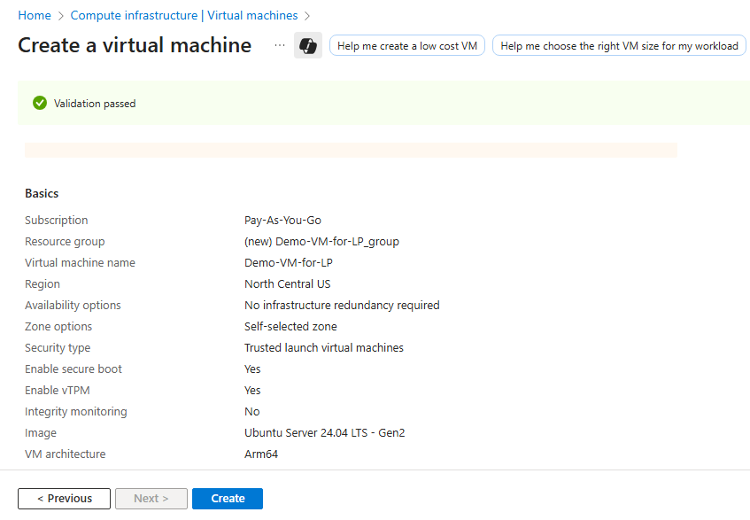

## Introduction

There are several ways to create an Arm-based Cobalt 100 virtual machine : the Microsoft Azure console, the Azure CLI tool, or using your choice of IaC (Infrastructure as Code). This guide will use the Azure console to create a virtual machine with Arm-based Cobalt 100 Processor. 

This learning path focuses on the general-purpose virtual machine of the D series. Please read the guide on [Dpsv6 size series](https://learn.microsoft.com/en-us/azure/virtual-machines/sizes/general-purpose/dpsv6-series) offered by Microsoft Azure.  

If you have never used the Microsoft Cloud Platform before, please review the microsoft [guide to Create a Linux virtual machine in the Azure portal](https://learn.microsoft.com/en-us/azure/virtual-machines/linux/quick-create-portal?tabs=ubuntu). 

#### Create an Arm-based Azure Virtual Machine 

Creating a virtual machine based on Azure Cobalt 100 is no different from creating any other virtual machine in Azure. To create an Azure virtual machine, launch the Azure portal and navigate to "Virtual Machines".
1. Select "Create", and click on "Virtual Machine" from the drop-down list.
2. Inside the "Basic" tab, fill in the Instance details such as "Virtual machine name" and "Region".
3. Choose the image for your virtual machine (for example, Ubuntu 24.04) and select “Arm64” as the VM architecture.
4. In the “Size” field, click on “See all sizes” and select the D-Series v6 family of virtual machines. Select “D4ps_v6” from the list.

5. Select "SSH public key" as an Authentication type. Azure will automatically generate an SSH key pair for you and allow you to store it for future use. It is a fast, simple, and secure way to connect to your virtual machine.
6. Fill in the Administrator username for your VM.
7. Select "Generate new key pair", and select "RSA SSH Format" as the SSH Key Type. RSA could offer better security with keys longer than 3072 bits. Give a Key pair name to your SSH key.
8. In the "Inbound port rules", select HTTP (80) and SSH (22) as the inbound ports.

9. Click on the "Review + Create" tab and review the configuration for your virtual machine. It should look like the following:

10. Finally, when you are confident about your selection, click on the "Create" button, and click on the "Download Private key and Create Resources" button.

11. Your virtual machine should be ready and running within no time. You can SSH into the virtual machine using the private key, along with the Public IP details.

{}

To learn more about Arm-based virtual machine in Azure, refer to “Getting Started with Microsoft Azure” in [Get started with Arm-based cloud instances](/learning-paths/servers-and-cloud-computing/csp/azure).

{}
