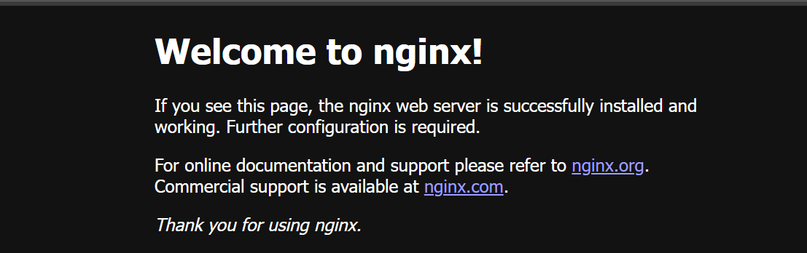

## Nginx Installation on Azure Linux 3.0

Install Nginx using `dnf` in the Azure Linux 3.0 environment, start the Nginx service, and allow **HTTP** in the firewall. Then access the default welcome page using your virtual machine’s public IP in a browser.

### Install Nginx

```console
sudo dnf install -y nginx 
sudo systemctl enable nginx 
sudo systemctl start nginx
```

### Verify Nginx

```console
sudo systemctl status nginx 
```
You should see an output similar to:

```output
● nginx.service - Nginx High-performance HTTP server and reverse proxy
     Loaded: loaded (/usr/lib/systemd/system/nginx.service; enabled; preset: disabled)
    Drop-In: /usr/lib/systemd/system/service.d
             └─10-timeout-abort.conf
     Active: active (running) since Wed 2025-07-30 04:29:02 UTC; 2h 8min ago
   Main PID: 684 (nginx)
      Tasks: 2 (limit: 19091)
     Memory: 153.1M (peak: 155.2M)
        CPU: 30.234s
     CGroup: /system.slice/nginx.service
             ├─684 "nginx: master process /usr/sbin/nginx"
             └─685 "nginx: worker process"
```
Also, you can use the below command to see the installed version of Nginx:

```console
nginx -v
```
### Validation with curl
Validation with `curl` confirms that Nginx is correctly installed, running, and serving **HTTP** responses.

Run the following command to send a HEAD request to the local Nginx server:
```console
curl -I http://localhost/
```
The `curl -I http://localhost/` command sends a HEAD request to Nginx to check its **HTTP** response headers without downloading the page content.

You should see an output similar to:

```output
HTTP/1.1 200 OK
Server: nginx/1.25.4
Date: Wed, 30 Jul 2025 06:59:19 GMT
Content-Type: text/html
Content-Length: 615
Last-Modified: Tue, 29 Apr 2025 21:56:30 GMT
Connection: keep-alive
ETag: "68114b0e-267"
Accept-Ranges: bytes
```

Output summery:
- **HTTP/1.1 200 OK**: Nginx is responding successfully.
- **Server: nginx/1.25.4**: Confirms it's running Nginx.
- Confirms your web server is reachable on **localhost**.

### Allow HTTP Traffic in Firewall 

On Azure Linux 3.0 virtual machines, firewalld runs by default as an additional layer of firewall control. By default, it allows only SSH (22) and a few core services.
So even if Azure allows HTTP port 80 (port 80 is added to inbound ports during VM creation), your VM’s firewalld may still block it until you run:
```console
sudo firewall-cmd --permanent --add-service=http 
sudo firewall-cmd --reload 
```
You can verify that HTTP is now allowed by listing active services:
```console
sudo firewall-cmd --list-services
```
Example output:
```output
dhcpv6-client http https mdns ssh
```
If firewall-cmd is not found, ensure your $PATH includes standard directories:
```console
export PATH=/usr/local/sbin:/usr/local/bin:/usr/sbin:/usr/bin:/sbin:/bin
```
So now, when you type firewall-cmd, the shell searches through the updated $PATH, finds /usr/bin/firewall-cmd, and executes it.

However, if you are working inside an Azure Linux 3.0 Docker container hosted on an Ubuntu virtual machine, you must bind the container’s port 80 to the VM’s port 80 and then allow HTTP traffic through the Ubuntu VM’s firewall.

Create the Docker container as follows:
```console
sudo docker run -it --rm -p 80:80 mcr.microsoft.com/azurelinux/base/core:3.0
```
This command maps container port 80 to the Ubuntu VM’s port 80. The Nginx installation steps inside the Azure Linux 3.0 container remain the same as described above.
Now, to allow HTTP in the firewall on your Ubuntu virtual machine, run as follows:
```console
sudo ufw allow 80/tcp
sudo ufw enable
```

Now you can access the NGINX default page in a browser. Run the following command to print your VM’s public URL, then open it in a browser:
```console
echo "http://$(curl -s ifconfig.me)/"
```

You should see the Nginx page confirming a successful installation of Nginx.


Nginx installation is complete. You can now proceed with the baseline testing ahead.
