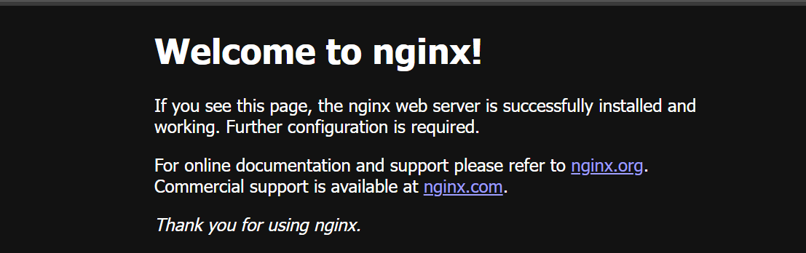

## Nginx Installation on Azure Linux 3.0

Install Nginx using `dnf`, start the service, and allow **HTTP/HTTPS** in the firewall. Then access the default welcome page using your virtual machine’s public IP in a browser.

### Install Nginx

```console
sudo dnf install -y nginx 
sudo systemctl enable nginx 
sudo systemctl start nginx
```

### Verify NGINX is running: 

```console
sudo systemctl status nginx 
```
You should see an output similar to:

```output
● nginx.service - Nginx High-performance HTTP server and reverse proxy
     Loaded: loaded (/usr/lib/systemd/system/nginx.service; enabled; preset: disabled)
    Drop-In: /usr/lib/systemd/system/service.d
             └─10-timeout-abort.conf
     Active: active (running) since Wed 2025-07-30 04:29:02 UTC; 2h 8min ago
   Main PID: 684 (nginx)
      Tasks: 2 (limit: 19091)
     Memory: 153.1M (peak: 155.2M)
        CPU: 30.234s
     CGroup: /system.slice/nginx.service
             ├─684 "nginx: master process /usr/sbin/nginx"
             └─685 "nginx: worker process"
```
Also, you can use the below command to see the installed version of Nginx:

```console
nginx -v
```
Allowing **HTTP** and **HTTPS** traffic in the firewall ensures that your Nginx web server can receive requests from web browsers. 
### Allow HTTP Traffic in Firewall 

```console
sudo firewall-cmd --permanent --add-service=http 
sudo firewall-cmd --permanent --add-service=https 
sudo firewall-cmd --reload 
```
Now you can access the NGINX default page in a browser:

```console
http://<your-vm-public-ip>/ 
```
You should see the NGINX welcome page confirming a successful deployment.


Nginx installation is complete. You can now proceed with the baseline testing.
